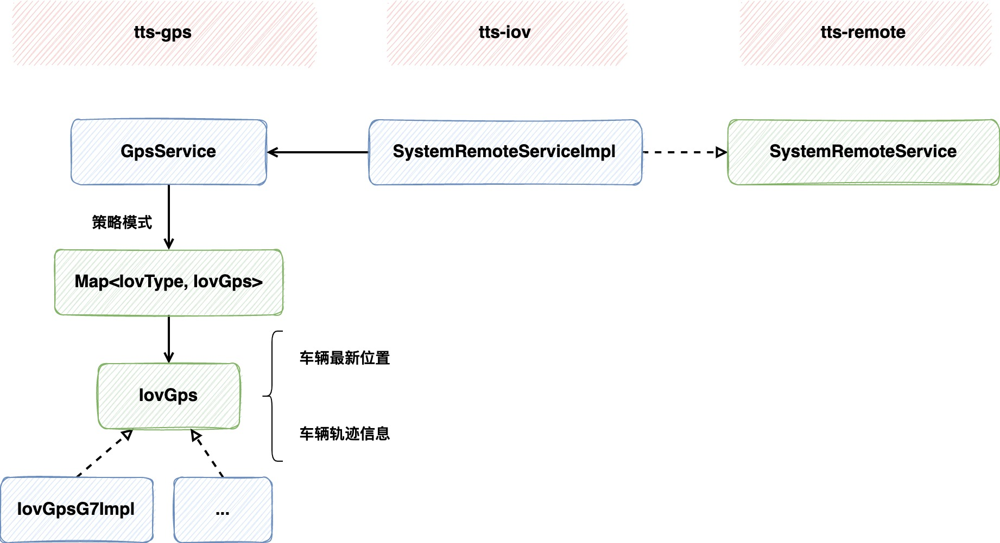
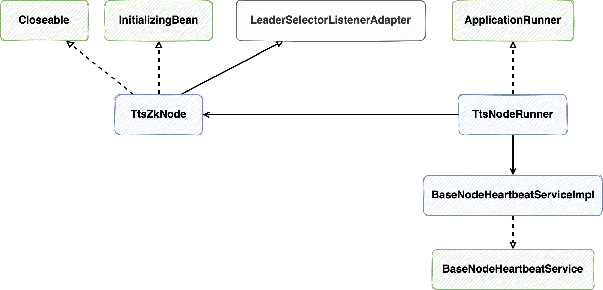
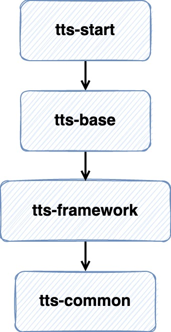

## Transportation Track System

## 1. 它能干什么事儿？
1. **查询不同GPS设备当前实时车辆轨迹和车辆位置**，直接在参数上指定对应的GPS设备枚举即可
2. **订阅车辆轨迹记录任务**，将对应车辆的点位保存，以供查看历史轨迹

### 1.1 策略模式在轨迹查询中的应用
系统中有多种GPS设备服务，每种服务都有对应的实现，采用**策略模式**来解决服务调用时能够分配到所需的服务类型

```java
@Service
public class GpsService implements InitializingBean {

    /**
     * key: iovTypeName value: service
     */
    private Map<String, IovGps> gpsServiceMap;

    @Override
    public void afterPropertiesSet() {
        // 将所有的GPS类型bean封装起来，根据策略模式按需取
        gpsServiceMap = SpringUtils.getBeansOfType(IovGps.class);
    }
}
```

1. 定义Map对所有服务实现类进行管理，实现`InitializingBean`接口，在bean初始化时使用**依赖查找**把实现类都封装在Map中，
   其中`IovGps`是所有Gps实现类都要实现的通用接口
    
2. Map保存数据的形式: key为Gps设备类型名，value为对应的服务实现类，这样就可以把设备名服务一一对应上，
   需要注意的是要在具体实现类指定bean的名字为对应类型名，如下
   ```java
   @Service(value = "G7")
   public class IovGpsG7Impl implements IovGps {
    // ...
   }
   ```
   
3. 当要获取具体的类型时，直接传入枚举值即可
```java
@Service
public class GpsService implements InitializingBean {

    // ...
    
    /**
     * 获取具体业务类型的服务对象
     */
    public IovGps getSpecificService(IovTypeEnums iovTypeEnum) {
        if (iovTypeEnum != null) {
            Set<String> keySet = gpsServiceMap.keySet();
            for (String beanName : keySet) {
                if (beanName.contains(iovTypeEnum.getValue())) {
                    return gpsServiceMap.get(beanName);
                }
            }

            throw new ServiceException("不支持" + iovTypeEnum.getValue() + "类型查询");
        }

        throw new ServiceException("参数异常");
    }
}
```

- **使用策略模式的优势**: 遵守**开闭原则**，使得在新增任何GPS类型实现时，都无需对代码进行改动，它会自动进行封装，在需要时提供服务

#### 1.1.1 调用流程



### 1.2 车辆订阅任务的执行与分配

TTS采用**多节点集群模式**进行部署，节点中角色分为`Leader`和`Follower`，其中`Leader`的职责是**检查各个服务的心跳时间**和**分配订阅任务**给`Follower`节点，
而`Follower`节点则负责执行订阅任务

1. **集群高可用**: 借助zookeeper实现，依赖zookeeper提供的选举来分配各个节点的角色，保证集群的高可用
2. **订阅任务的高可用**: 每个节点服务都会在规定时间内记录节点心跳，`Leader`节点会检查心跳，若某节点心跳超时，
   则会将该节点上**没有结束的任务**重新分配给其他`Follower`节点，以保证订阅任务的高可用
   
#### 1.2.1 实现原理


- **LeaderSelectorListenerAdapter**: 实现节点的选举，分出Leader和Follower节点负责不同的职责
- **InitializingBean**: 初始化节点中的必要信息
- **Closeable**: 为了调用`close()`方法优雅的释放资源

`TtsNodeRunner`实现`ApplicationRunner`随服务启动，调用节点的启动方法，让zookeeper帮忙分配角色

- **BaseNodeHeartbeatService**: 服务节点心跳服务，随服务启动，每隔N秒更新服务节点心跳并记录心跳流水

## 2. Maven依赖关系



- `tts-start`: 轨迹服务启动模块，包含启动类和一些必要的`ApplicationRunner`，其中`ApplicationRunner`包括`NodeRunner`和`NodeTaskRunner`，
  前者负责初始化节点信息并将节点交由zookeeper进行管理，后者负责执行节点任务   
- `tts-iov`: 轨迹服务核心模块，定义了节点任务的执行逻辑，包含GPS配置服务、任务订阅服务以及对点位处理的服务等
- `tts-node`: 轨迹服务节点模块，都是关于节点的功能：节点的配置、心跳记录等
- `tts-gps`: GPS设备接口模块，提供不同设备的轨迹、点位查询服务，使用策略模式将多种服务封装，在调用时根据枚举自动匹配GPS服务
- `tts-remote`: Dubbo RPC 接口模块，供其他项目依赖、调用接口查询点位和订阅任务
- `tts-framework`: 框架支持，包含一些配置
- `tts-common`: 通用的枚举和工具类等

---
**That's all.**
