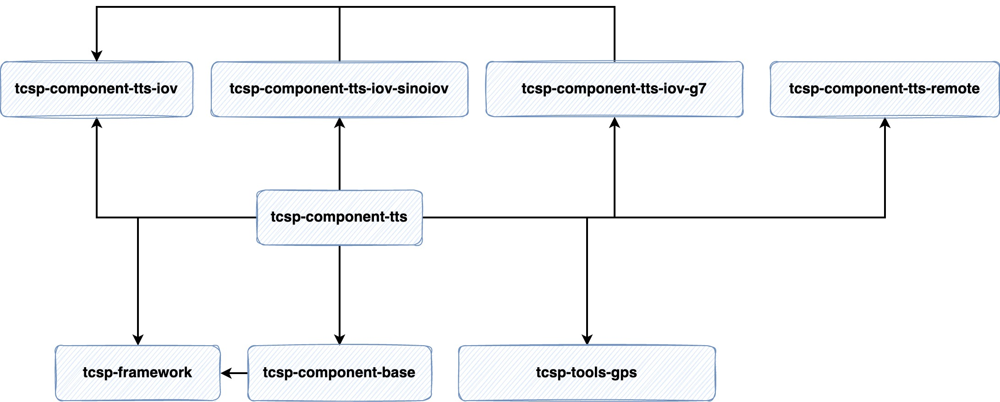
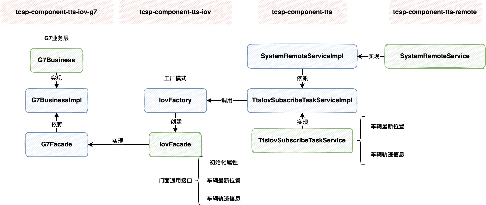

## TTS

## 1. TTS组件MAVEN依赖图

其中 `tcsp-component-tts` 为轨迹服务核心模块，其中图示下方为通用依赖

- `tcsp-framewoek`: 框架核心，通用的工具类、AOP、注解、配置类等
- `tcsp-component-base`: 基础数据DAO、Service实现
- `tcsp-tools-gps`: 主要是经纬度不同坐标系转化工具类

其中图示上方为轨迹业务不同的实现，分别放在了不同的module里

- `tcsp-component-tts-remote`: 这个主要是开放一些通用的方法，达成jar包后供其他系统依赖使用
- `tcsp-component-tts-iov`: 车联网通用接口层，定义了三个通用的方法：
  **初始化属性**，**车辆最新位置**、**车辆轨迹信息** 以供具体业务做不同的实现；
  另外还使用了**工厂模式**，不同的轨迹业务服务（g7、中交兴路）没有被Spring管理起来，
  而是每次这些接口被调用时用工厂模式创建对象
- `tcsp-component-tts-iov-sinoiov`、`tcsp-component-tts-iov-g7`:
  分别为中交兴路，和g7轨迹业务的具体方法实现

问题

## 2. TTS服务
### 2.1 节点类型及其作用

- **Leader**: 负责分配任务和检查从节点任务的心跳状态
- **Follower**: 执行任务和更新任务的状态

### 2.2 集群高可用

借助zookeeper

### 2.3 任务的高可用
心跳机制

## 3. TTS开放接口
### 3.1 外部轨迹服务接入（G7）

1. `SystemRemoteService`开放通用接口方法供其他服务调用，
   将`tcsp-component-tts-remote`打成jar包，其他项目进行依赖即可
2. `SystemRemoteServiceImpl`实现`SystemRemoteService`做具体方法实现，
   依赖TTS轨迹服务
3. 在TTS轨迹服务`TtsIovSubscribeTaskService`中，调用`IovFactory`的工厂方法，
   根据**配置的轨迹业务不同创建不同的轨迹业务服务**。
   但是轨迹服务调用查询轨迹、车辆位置的方法时，每次都会调用一次工厂方法，创建对象。

### 3.2 APP轨迹服务接入
