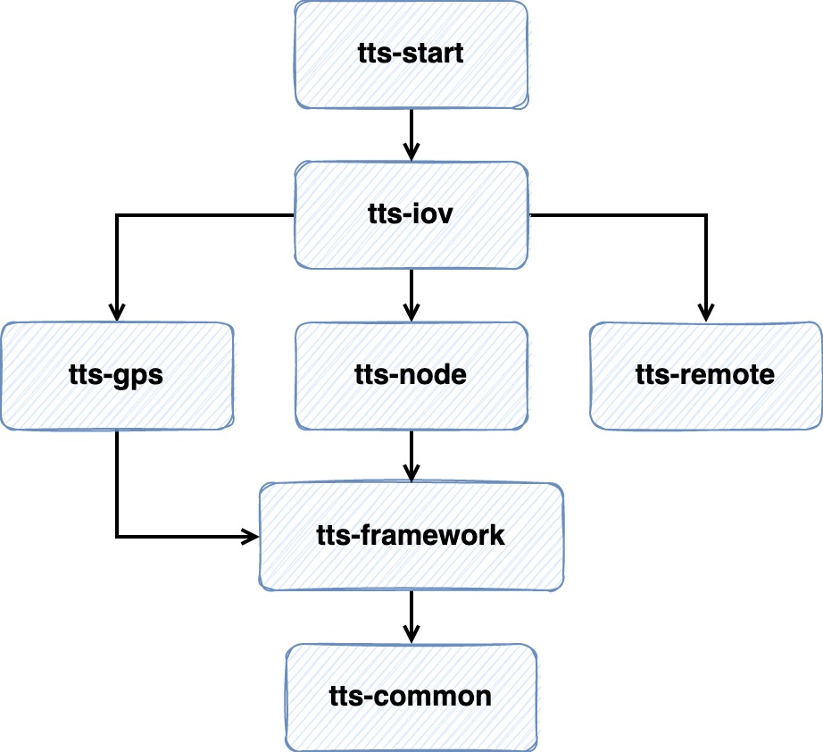

## Transportation Track System

## 1. 它能干什么事儿？
1. **查询不同GPS设备实时车辆轨迹和车辆位置**（直接在参数上指定对应的GPS设备枚举即可）
2. **订阅车辆轨迹记录任务**: 将对应车辆的点位入库保存，以供历史轨迹查看

## 2. 其中的要点
### 2.1 策略模式在轨迹查询中的应用
系统中有多种GPS设备服务，每种服务都有对应的实现，既然存在多种服务，那么在服务调用时选取合适的服务便是需要解决的问题。

TTS采用的是策略模式解决上述问题。如下是通用的`GpsService`服务代码实现

```java
@Service
public class GpsService implements InitializingBean {

    /**
     * key: iovTypeName value: service
     */
    private Map<String, IovGps> gpsServiceMap;

    @Override
    public void afterPropertiesSet() {
        // 将所有的GPS类型bean封装起来，根据策略模式按需取
        gpsServiceMap = SpringUtils.getBeansOfType(IovGps.class);
    }
}
```

1. 定义`Map<String, IovGps>`对所有GPS服务实现类进行管理，Map保存数据的形式: key为Gps设备类型名，value为对应的服务实现类，
   这样就可以把设备名和服务一一对应上，需要注意的是要在**具体实现类指定bean的名字为对应GPS类型**名。
   如下所示，那么它在Map中的保存形式即为 `key: G7, value: IovGpsG7Impl`
      ```java
   @Service(value = "G7")
   public class IovGpsG7Impl implements IovGps {
    // ...
   }
   ```

2. 实现`InitializingBean`接口，在bean初始化时使用**依赖查找**把实现类都封装在Map中， 其中`IovGps`是所有Gps实现类都要实现的通用接口
   
3. 当要获取具体的类型时，直接传入枚举值即可
```java
@Service
public class GpsService implements InitializingBean {

    // ...
    
    /**
     * 获取具体业务类型的服务对象
     */
    public IovGps getSpecificService(IovTypeEnums iovTypeEnum) {
        if (iovTypeEnum != null) {
            Set<String> keySet = gpsServiceMap.keySet();
            for (String beanName : keySet) {
                if (beanName.contains(iovTypeEnum.getValue())) {
                    return gpsServiceMap.get(beanName);
                }
            }

            throw new ServiceException("不支持" + iovTypeEnum.getValue() + "类型查询");
        }

        throw new ServiceException("参数异常");
    }
}
```

- **优势**: 使用策略模式遵守**开闭原则**，使得在新增任何GPS类型实现时，都无需对原有代码进行改动，只需开发新的GPS服务即可，它会自动进行封装，在需要时提供服务

#### 2.1.1 调用流程


`SystemRemoteService`被其他项目依赖，作为dubbo接口注入，它的实现类中包含`GpsService`，这里使用了上述的策略模式，
包含具体Gps设备类型的实现，易扩展。整条调用链路只有被标记为`...`的扩展类在新增GPS设备服务时需要进行扩展，
其他部分代码都无需改动，能够通用。

### 2.2 车辆订阅任务的执行与分配

TTS采用**多节点集群模式**部署，节点中角色分为`Leader`和`Follower`，其中`Leader`的职责是**检查各个服务的心跳**和**分配订阅任务**给`Follower`节点，
而`Follower`节点则负责执行订阅任务，集群、订阅任务的高可用保证了服务正常运行。

1. **集群高可用**: 借助zookeeper实现，依赖zookeeper提供的选举来**分配各个节点的角色**，并提供节点管理的方法，使用zookeeper实现集群高可用是非常便捷的方式
2. **订阅任务的高可用**: 每个节点服务都会在规定时间内记录节点心跳，`Leader`节点会定期检查心跳，若某节点心跳超时，
   则会将该节点上**没有结束的任务**重新分配给其他`Follower`节点，以保证订阅任务的高可用
   
#### 2.2.1 实现原理


TTS节点实现如下接口
- **LeaderSelectorListenerAdapter**: 以此来借助zookeeper实现节点的选举和集群高可用，分出`Leader`和`Follower`节点负责不同的职责
- **InitializingBean**: 服务启动时，初始化节点中的必要配置信息
- **Closeable**: 为了调用`close()`方法优雅的释放节点资源

`TtsNodeRunner`是节点服务的启动类，实现`ApplicationRunner`接口，所以会随应用启动而启动，
其中包含`BaseNodeHeartbeatService`服务节点心跳服务，每隔N秒更新服务节点心跳并记录心跳流水，保证订阅任务的高可用


`TtsNodeTaskRunner`是节点任务服务的启动类，同样实现了ApplicationRunner接口，会随应用的启动而启动，
它其中依赖了`TtsZkNode`节点等其他必要服务，核心任务执行逻辑如下

```java
/**
 * 初始化节点任务
 */
private void initialTask() {
    while (true) {
        // leader节点负责检查心跳和分配任务
        if (node.getIsLeader().get()) {
            // 处理leader节点的任务，心跳检测和分配任务
            processLeaderTask();
        } else {
            // 普通节点将被分配的任务设置为运行状态，并启动任务线程执行
            runningTask();
        }

        try {
            Thread.sleep(TASK_INTERVAL * 1000);
        } catch (Exception e) {
            log.error("Node Task sleep error", e);
        }
    }
}
```
定义任务循环，根据节点的类型来执行不同的任务，`Leader`节点负责检查心跳和分配任务，`Follower`节点则负责执行任务

## 3. Maven依赖关系
TTS服务各个模块依赖关系清晰明确，如下图所示



- `tts-start`: 轨迹服务启动模块，包含启动类和一些必要的`ApplicationRunner`，其中`ApplicationRunner`包括`NodeRunner`和`NodeTaskRunner`，
  前者负责初始化节点信息并将节点交由zookeeper进行管理，后者负责执行节点任务
- `tts-iov`: 轨迹服务核心模块，定义了节点任务的执行逻辑，包含GPS配置服务、任务订阅服务以及对点位处理的服务等
- `tts-node`: 轨迹服务节点模块，都是关于节点的功能：节点的配置、心跳记录和节点管理方法等
- `tts-gps`: GPS设备接口模块，提供不同设备的轨迹、点位查询服务，使用策略模式将多种服务封装，在调用时根据枚举自动匹配GPS服务
- `tts-remote`: Dubbo RPC 接口模块，供其他项目依赖、调用接口查询点位和订阅任务
- `tts-framework`: 框架支持，包含一些配置
- `tts-common`: 通用的枚举和工具类等

## 4. 测试和使用

1. 修改`application.yml`配置文件中`zookeeper.address`和`dubbo.registry.address`地址信息，将它们修改成自己的服务地址

2. 修改application-druid.yml配置文件中的数据库连接配置信息，并创建tts的mysql数据库，执行sql包下的脚本
 
3. 调用SystemRemoteService中saveOrUpdateIovConfig方法添加Gps设备配置信息，以此来调用各Gps供应商接口
   （这配置一般人哪有？所以开发出一个能自主提供gps数据的接口才能正常测试）

4. 添加多个Service启动配置，启动即可进行验证...

---
**That's all.**
